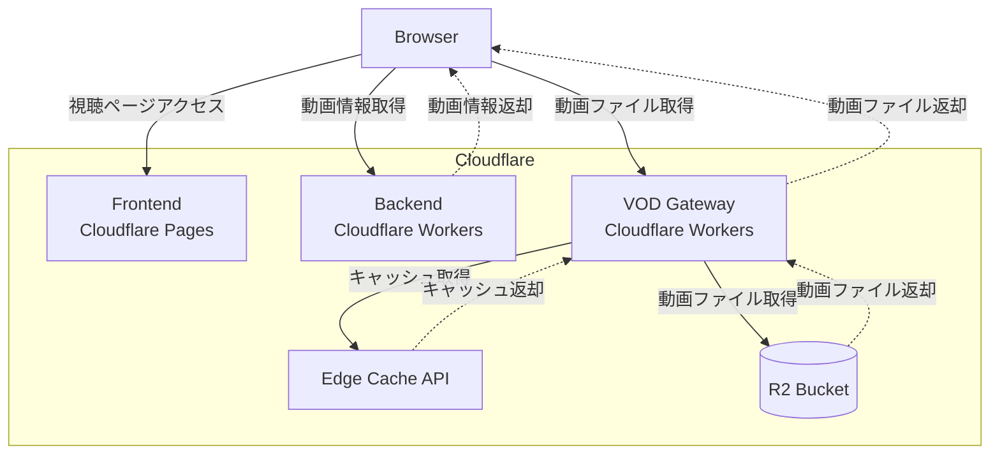

# poc-cloudflare-r2-vod

Cloudflare R2を活用した、VOD配信の実証コードです。

HLS形式で書き出された動画ファイルをCloudflare R2に保管し、CloudFrontのカスタムポリシー互換の署名付きCookieによるアクセス制御を行います。

## Architecture

### backend

プロジェクトディレクトリ: `apps/backend/`

動画IDからCloudflare R2のURLと署名付きCookieを生成するAPIを提供します。

APIのインターフェースとして、[Connect](https://connectrpc.com)を使用しています。

Cloudflare Workersで動作します。

## frontend

プロジェクトディレクトリ: `apps/frontend/`

動画を視聴するためのReactアプリケーションです。

`backend` から 動画URLと署名付きCookieを取得し、HLS.jsを使用して、Cloudflare R2に保存されている動画を再生します。

Cloudflare PagesにSPAアプリケーションとしてデプロイします。

## vod-gateway

プロジェクトディレクトリ: `apps/vod-gateway/`

Cloudflare R2に保管されている動画ファイルへのアクセスを制御するためのゲートウェイです。

CloudFrontの署名付きCookieを検証し、動画ファイルへのアクセスを検証します。

署名が有効であればR2から動画ファイルを取得し、レスポンスを返します。
また、Edge Cacheに動画をキャッシュします。

Cloudflare Workersで動作します。
